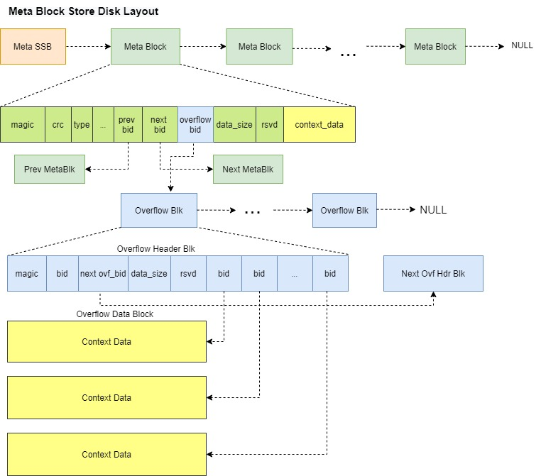

# MetaBlk Manager 

## Overview


## Requirements
1. A common service for client to register and perist meta data (super blocks);
2. Any new client can register/deregister itself dynamically with unique name. 
3. After registeration, client can add/update/remove their meta data independently and concurrently;
4. During reboot, MetaBlkStore will load all the meta blocks and send call back all registered clients. 
   After all meta blocks have been sent to client, a completion callback will be sent to client. 
5. Need to be able to survice carsh in the middle at any point, e.g. after reboot, on disk layout as well as in-memory 
   data structure needs to be consistent, complete and correct;

## APIs

Register:
```
REGISTER_METABLK_SUBSYSTEM(name, type, cb, comp_cb) 
register_handler(const meta_sub_type type, const meta_blk_found_cb_t& cb,
                 const meta_blk_recover_comp_cb_t& comp_cb, const bool do_crc = true);
```

Write:
```
void add_sub_sb(const meta_sub_type type, const void* context_data, const uint64_t sz, void*& cookie);
```

Update:
```
void update_sub_sb(const void* context_data, const uint64_t sz, void*& cookie);
```

Remove:
```
std::error_condition remove_sub_sb(const void* cookie);
```

During reboot, all written super blocks will be collected by MetaBlk Mgr and sent back to every registered sub-component.
After each sub-component received their super blocks, each component can start their recovery process;

## On-Disk Layout


