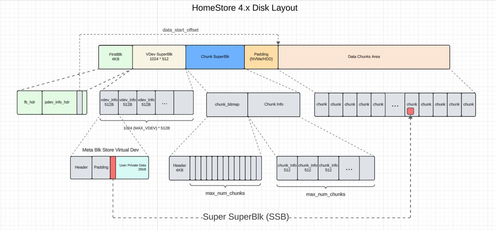

# Device Manager

## HomeStore 4.x Disk Layout
1. max_num_chunks is decided by device size and min_chunk_size which is configurable by HomeStore sconsumer
2. Super SuperBlk (SSB) is the first meta blk to load Meta Service. All other System Meta Blks are chained together by loading the SSB 

