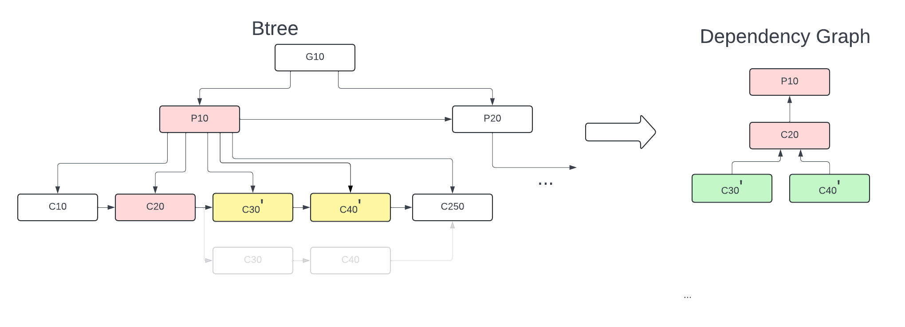

# Index Crash Recovery

This README explains the design of the Index table btree crash recovery. Here are some design principles for this feature.

1. Index table and service is designed to recover from unclean shutdown for only its structures and not its data. In other words, if in the btree one has inserted 100 entries earlier and now inserted another 20 entries in memory and persist them lazily, if there is an unclean shutdown, crash recovery only ensures that it has recovered first 100 and 0-20 of the remaining new entries could be recovered. It relies on the consumer of index service to save it in journal and replay upon unclean restart.
2. It guarantees however, that it will not lose anything that was previously persisted and also its structures are intact so that subsequent new entries are insertable upon restart. 
3. The recovery code path is favored towards design simplicity rather than performance oriented. As a result, its goal is not prevent the most optimal solution (reduce the number of nodes read or repaired etc). It is also tilted in favor of high performance during active btree writes and checkpoints (instead of optimal recovery).

## Atomicity Requirements
Homestore btree nodes attempts to modify the node in-place and doesn't write the node into a new location. There are alternates to that, which is out-of-scope to this README. This provides the benefit of reduce write amplification, since every update, only that node will be written, instead of writing every level. Similary, during split and merge of btree nodes, homestore will write the existing node in-place thus writing only required nodes and nothing more. This design needs to take care of split/merge atomicity. 

If a key/value is inserted, updated or removed from the btree node is modified and node is persisted during cp atomically automatically, because the node size is picked as same size as underlying drive's atomic page size. As a result, recovery doesn't need to worry about torn btree pages. However, once the node gets full, it needs to split. Following diagram illustrates a typical btree structure.


Lets say multiple entries are inserted into the leaf node C10, so that it is full. This will result in split of btree node C10, where we create new btree node C15 and move approx half of the entries from C10 to C15 and update the parent with new link to C15. There are 3 nodes to be persisted as part of split. P10, C10 and C15. If they are not atomically updated it can result in data loss. 


* If C15 is persisted during cp and then an unclean shutdown happened, there is no harm done, since structure is intact (as only new nodes are written)
* If only C10 is persisted and not others, it is a direct data loss, because C10 now has only half of the data and remaining are in C15 which is not persisted and lost them.
* If only P10 is persisted and not C10 and C15, parent is pointing to a zombie link (which technically can be repaired but with significant code complexity).

So there needs to an atomicity required on persisting these nodes. Homestore Writeback cache layer achieves this by doing dependency chain.

## Split Node Atomicity
Writeback cache layer sitting below the Index Btree, which caches the buffer for all nodes, maintain a dependency list, similar to a graph. In the above example it maintains a dependency list as follows:


Here the lowest buffer (down node buffer C15) is persisted first and then first up buffer C10 is persisted followed by P10. With this ordering of persistence, 

* In case system crashes after persisting C15 no harm done, because it was a new node and C10 after restart will have old contents (without the one which was split and moved the portion of data to C15). 
* In case if after persisting C15 and then C10, system crashes, data is not lost, but P10 (parent) lost its link to C15. To overcome this issue, Writeback cache layer also writes following information to journal { <ExistingParentID>, <ExistingChildId>, <NewChildID> } before taking Checkpoint. Please note that we only store the IDs and not actual contents. With this ID, parent P10 will be repaired during recovery.

Upon recovery, the entire journal is walked across and does the following checks:

NewChildID: Read the node from store and check if new child has been written. This is checked by actually looking for valid btree node and cp_id (which is always monotonically increasing number). If its not written, no need of any repair.

ExistingChildID: Check if this node has already been written as part of previous cp_id. If not, no harm done and btree structure from this journal entry perspective is intact.

ExistingParentID: Check if this node has already been written as part of previous cp_id. If so, no action needed. If not written, then it redo the entire child links by walking across all its child nodes, read them and put the valid links of the child into the parent node.

### Multiple Split Node Atomicity

We carry on with the previous example and in the same checkpoint session, if the new node C15 is split. The atomicity needs to be guaranteed between P10, C15 and new node C18. Then the btree structure and its dependency graph will become as follows


Given that left child (in-place modified) node C15 is itself a new node for this CP, Writeback cache doesn't put another dependency level, but simply link it to the C15's up buffer, C10. It is to be noted that, journal entry will create a new entry and doesn't modify the existing entries. However, during recovery, the entire journal is replayed and the dependency graph is built before starting to do repair. 

In this example, there will 2 journal entries so far in format
```
{ <ExistingParentID>, <ExistingChildId>, <NewChildID> } 
{P10, C10, C15}
{P10, C10, C18}
```

Lets take it further, where the previous in-place modified node C10 itself is split now in the same CP as C10 and C12, the graph would look like


When multiple existing node is split, we link the new node also into C10. At this point, until C10 is written, it is safe to discard everything below, C15, C18 or C12, in case of an unclean shutdown and we don't need to recover C10 (as btree structure is still intact and no previous cp's data is lost). Journal will look like the following.
```
{ <ExistingParentID>, <ExistingChildId>, <NewChildID> } 
{P10, C10, C15}
{P10, C10, C18}
{P10, C10, C12}
```

### Parent Split Node Atomicity

Let us continue the above example with a split of parent node in this chain. Parent node P10 is split into P10, P20 and written to its parent G10. The tree and graph would look like


The key thing to note here, is dependency chain is built for P10 with P20 as well. So P10 will not persisted until C10 and P20 is persisted. However, ordering between P20 and C10 doesn't matter, because even if P20 is persisted and not C10, no harm done (since P20 is a new node). If C10 is persisted and not P20, P10 will have old contents and no record of P20. So P10 will just repair itself from reading C10 (like cases listed above).

The journal entries will look like the following
```
{ <ExistingParentID>, <ExistingChildId>, <NewChildID> } 
{P10, C10, C15}
{P10, C10, C18}
{P10, C10, C12}
{G10, P10, P20}
```

## Merge Node Atomicity

Merge node happens somewhat similar to split node with respect to the atomicity requirements. In the example tree, we have node C20, C30, C40 are merged and in worst case entries are rebalanced across these 3 nodes. However, it is also possible that 3 nodes are merged into either 2 or even 1 node. Irrespective of the type of merge, logic is similar.

Homestore Index service creates 2 more new nodes to replace C30, C40 lets say C30' and C40' respectively and now C20 is linked to C30' and C40' and C30, C40 nodes are deleted.

With this in perspective, dependency graph will link similar to split nodes with new nodes linked to left child, which is linked to parent node.



The journal entries will need to record the existing node deletion information as well. This is needed, so that upon recovery, once left child is written, we need to redo the free as well

```
{ <ExistingParentID>, <ExistingChildId>, <NewChildID>, <FreedChildIDs> } 
{P10, C20, [C30', C40'], [C30, C40]}
```